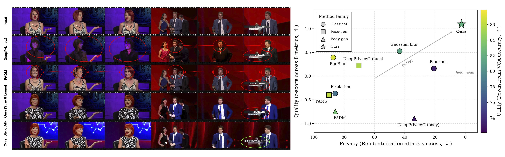
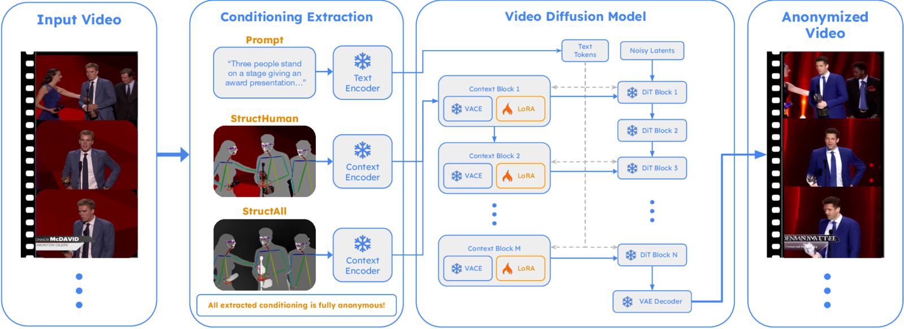

# ReGenHuman: Re-Generating Human Appearances for Realistic Full-Body Video Anonymization

**NeurIPS 2026** · [Paper](https://arxiv.org/abs/2606.14972) · [Project page](https://regenhuman.github.io)



ReGenHuman anonymizes videos of people by **regeneration instead of
editing**: the original clip is reduced to identity-free structural cues —
monocular depth, a DWPose skeleton, and a human mask — and a video diffusion
model (Wan2.1-VACE-1.3B + our 42 MB LoRA) re-synthesizes the video from
those cues. Because every output pixel is generated, **no original human
pixel can reach the output** — an architectural guarantee that editing-based
approaches (blurring, inpainting, face swap) cannot make.



Two variants:

| Variant | Conditioning | Output |
|---|---|---|
| **StructAll** | depth everywhere; human region flattened + skeleton | whole scene regenerated |
| **StructHuman** | original RGB background; human region masked to gray + skeleton | person regenerated, background preserved (useful for public settings) |

## Installation

```bash
conda env create -f environment.yml && conda activate regenhuman
pip install -e .
bash scripts/setup_models.sh        # DWPose + Video-Depth-Anything weights
```

Then download our pretrained LoRA weights
([Google Drive](https://drive.google.com/file/d/1-DrirLjXWGcXI9vY4TqewTZMEPCDWsxW/view?usp=sharing))
and unzip into the repo root so they land as `weights/`:

```bash
unzip ReGenHuman_weights.zip -d .   # -> weights/structall/step-16000.safetensors
                         #    weights/structhuman/step-16000.safetensors
```

The Wan2.1-VACE-1.3B base model (~19 GB) auto-downloads on the first run.
The default segmenter (SAM 3) has gated weights — request access at
[facebook/sam3](https://huggingface.co/facebook/sam3) and
`huggingface-cli login`, or use `--segmenter grounded_sam2` (non-gated).
Details, alternatives, and disk/VRAM budgets: [docs/INSTALL.md](docs/INSTALL.md).

## Quick start

A sample clip can be found in `assets/examples/`, with a
corresponding caption:

```bash
# Full-scene regeneration (StructAll) on the bundled example:
python demo.py --input assets/examples/sample.mp4 --variant structall \
    --prompt "$(cat assets/examples/sample_caption.txt)"

# Background-preserving (StructHuman), caption written by Qwen3-VL:
python demo.py --input assets/examples/sample.mp4 --variant structhuman --auto_caption
```

For your own videos, swap `--input` and either pass a dense `--prompt`
(~120-160 words; see the sample caption for the expected style) or use
`--auto_caption`.

One L40S/A6000-class GPU anonymizes a 49-frame clip in ~2.5 min (+ one-time
model loading). All intermediate artifacts (frames, depth, pose, masks,
conditioning video, `meta.json` provenance) are automatically saved in
`runs/<video>_<variant>/`.

### Usage notes

- **Prompts matter.** The model was trained with dense 
  captions; `--auto_caption` generates one with Qwen3-VL-8B. We use captions directly provided from HOIGen-1M and MedVideoCap-55K for our evals.
- **Longer videos** than 49 frames are generated in overlapping chunks with
  temporal carry-over (`--chunk_size`, `--frame_overlap`); ReGenHuman has not been tested on >49-frame
  outputs.
- **Privacy guard**: if the segmenter finds no person in some frames,
  StructHuman refuses to proceed (the original person would leak into the
  conditioning). Check `runs/.../masks/` when that
  happens.

## Pretrained weights

Download from
[Google Drive](https://drive.google.com/file/d/1-DrirLjXWGcXI9vY4TqewTZMEPCDWsxW/view?usp=sharing)
and unzip as `weights/` (see Installation): rank-32 LoRAs (alpha 32, modules
`q,k,v,o,ffn.0,ffn.2` of every VACE context-adapter block), step 16,000,
trained on HOIGen-1M (one per variant, 42 MB each, Apache-2.0). The base
model is untouched — these files only ever patch the context adapter.

| File | SHA-256 (prefix) |
|---|---|
| `weights/structall/step-16000.safetensors` | `ec5d90fc` |
| `weights/structhuman/step-16000.safetensors` | `f21c4926` |

## Training

Using your own videos + captions:

```bash
python scripts/prepare_dataset.py --videos_dir vids/ --captions caps.csv \
    --variant structall --out data/mine
bash scripts/apply_diffsynth_patch.sh
DATASET_DIR=data/mine/structall OUTPUT_DIR=outputs/structall_lora bash scripts/train_lora.sh
```

Full recipe (identical to the released weights): [docs/TRAINING.md](docs/TRAINING.md).

## License

Our code and the LoRA weights: **Apache-2.0** ([LICENSE](LICENSE)).
Third-party components keep their own licenses ([NOTICE](NOTICE)):

| Component | License |
|---|---|
| Wan2.1-VACE-1.3B, DiffSynth-Studio, DWPose (+ ONNX weights), SAM2, GroundingDINO, Qwen3-VL | Apache-2.0 |
| SAM 3 (code + weights) | SAM License (gated) |
| Video-Depth-Anything code / ViT-S weights | Apache-2.0 |
| **Video-Depth-Anything ViT-L weights (default)** | **CC-BY-NC-4.0 — non-commercial** |

For commercial settings, run `WITH_VITS=1 bash scripts/setup_models.sh` and
pass `--depth_encoder vits` (Apache-licensed depth weights; slightly
off-distribution for the released LoRAs, which were trained on ViT-L depth).

## Acknowledgements

Built on [DiffSynth-Studio](https://github.com/modelscope/DiffSynth-Studio),
[Wan2.1](https://github.com/Wan-Video/Wan2.1) /
[VACE](https://github.com/ali-vilab/VACE),
[DWPose](https://github.com/IDEA-Research/DWPose) (ONNX inference code via
[ControlNet-v1-1-nightly](https://github.com/lllyasviel/ControlNet-v1-1-nightly),
weights by [yzd-v](https://huggingface.co/yzd-v/DWPose)),
[Video-Depth-Anything](https://github.com/DepthAnything/Video-Depth-Anything),
[SAM 3](https://github.com/facebookresearch/sam3),
[SAM 2](https://github.com/facebookresearch/sam2) +
[GroundingDINO](https://github.com/IDEA-Research/GroundingDINO), and
[Qwen3-VL](https://huggingface.co/Qwen/Qwen3-VL-8B-Instruct). Training data
from [HOIGen-1M](https://github.com/HOIGen-1M). Thank you!

## Citation

```bibtex
@inproceedings{regenhuman2026,
  title     = {ReGenHuman: Re-Generating Human Appearances for Realistic Full-Body Video Anonymization},
  booktitle = {Advances in Neural Information Processing Systems (NeurIPS)},
  year      = {2026},
  eprint    = {2606.14972},
  archivePrefix = {arXiv},
  url       = {https://arxiv.org/abs/2606.14972},
}
```
